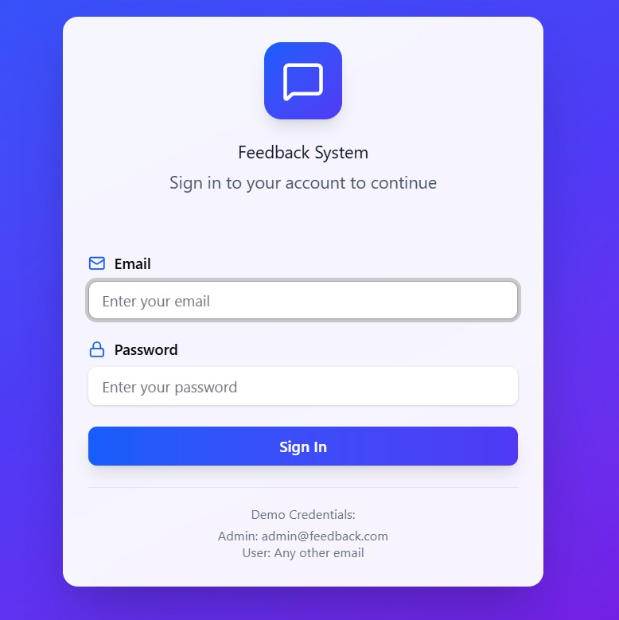
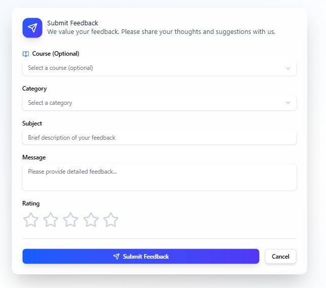
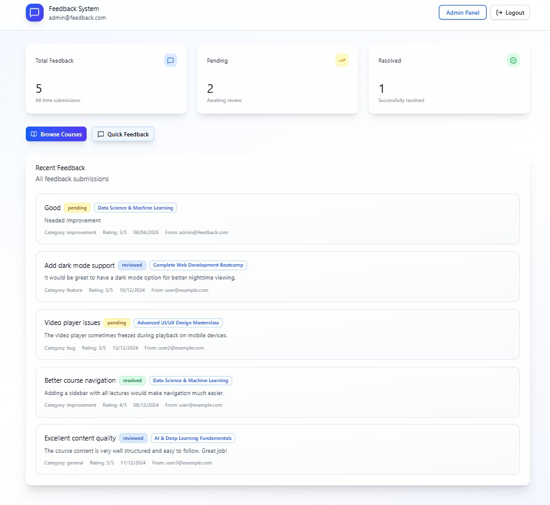
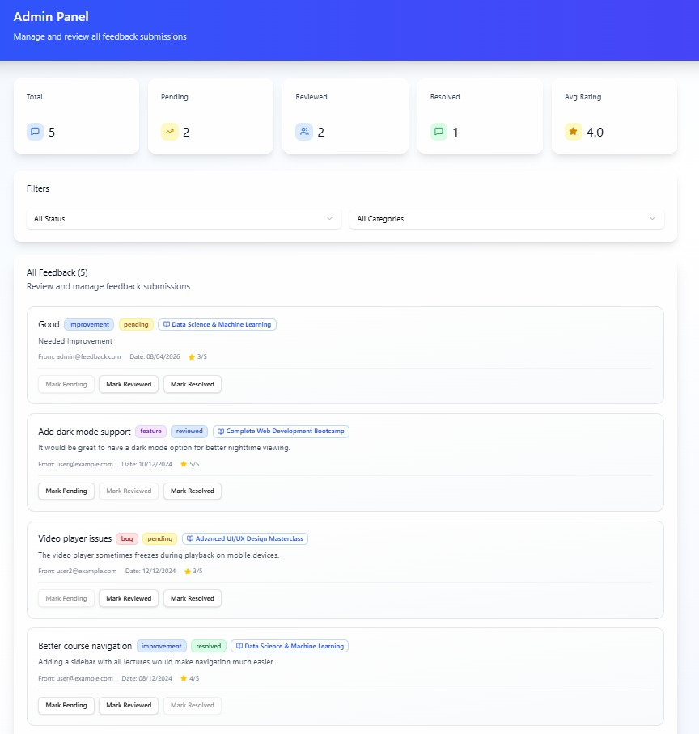

# 🎓 Student Feedback & Course Review System

## 📌 Description

A secure, database-driven application that allows students to submit feedback and ratings for courses. This system helps institutions analyze course quality and improve teaching effectiveness through structured data collection and retrieval.

---

## 🚀 Features

* 📝 Student feedback submission
* ⭐ Course rating system
* 🗂️ Data storage using DBMS
* 🔍 Easy retrieval and analysis of feedback
* 👨‍💼 Admin-level view for managing reviews (optional)

---

## 🛠 Tech Stack

* 💻 Python
* 🌐 HTML (Basic UI)
* 🗄️ SQLite / DBMS
* 📊 CRUD Operations

---

## 🗄️ Database Design

The system is structured using the following tables:

* **Students** → Stores student details
* **Courses** → Stores course information
* **Feedback** → Stores reviews submitted by students
* **Ratings** → Stores course ratings

---

## 📂 Project Structure

```
student-feedback-system/
│
├── app.py
├── dashboard.py
├── db.py
├── setup_db.py
├── sentiment.py
├── feedback.csv
├── feedback.db
├── requirements.txt
├── screenshots/
│   ├── home.png
│   ├── feedback.png
│   ├── output.png
│   ├── database.png
└── README.md
```

## 📷 Screenshots








## ▶️ How to Run

1. Clone the repository

```
git clone https://github.com/ranx-kernel/student-feedback-system.git
```

2. Navigate to project folder

```
cd student-feedback-system
```

3. Install dependencies

```
pip install -r requirements.txt
```

4. Run the application

```
python app.py
```

---

## 🔐 Security Considerations

* Input validation to reduce invalid or harmful data
* Basic protection against SQL injection
* Structured database handling for safer storage

---

## 📈 Future Improvements

* 🔐 User authentication system
* 🌐 Full web-based UI
* 📊 Analytics dashboard for insights
* 📱 Responsive design
* 🤖 AI-based feedback analysis

---

## 🎯 Purpose

This project demonstrates:

* Practical implementation of DBMS concepts
* Real-world problem solving
* Structured backend development
* Foundation for secure system design

---


